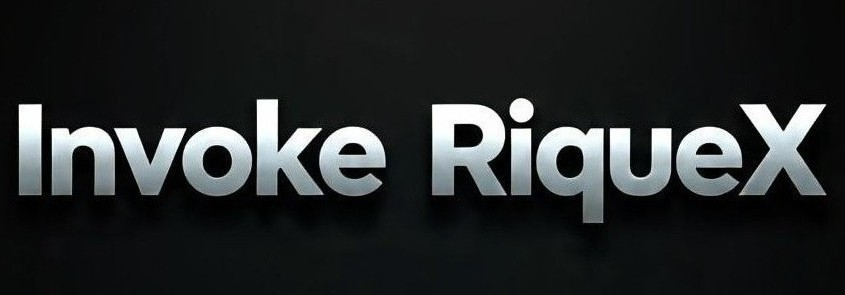

# OBSERVAÇÃO
Invoke RiqueX Não É Um Bot Completo E Sim Uma Base Pra Quem Não Queira Iniciar Do Zero.
Invoke RiqueX Pode Ter Erros.

## NOTA
Invoke RiqueX É Para Todos, Não Está À Venda. Se Você Vendê-lo, O Inferno Te Espera.

<p align="center">

</p>
<h1 align="center">HenriqueX Flow</h1>

# Tecnologias Utilizadas:
  

---

# Instalando Algumas Dependências Iniciais
```bash
# Ffmpeg Necessário Pra Fazer Figurinha
apt install ffmpeg
# NodeJs Necessário Pra Rodar O Bot
apt install nodejs-lts
```

## Iniciar O Bot Em Modo Desenvolvimento
```bash
# Clone O Repositório
git clone https://github.com/HenriqueX-Flow/Invoke-RiqueX.git
# Acessar A Pasta Do Bot
cd Invoke-RiqueX

# Instale As Dependências
npm install

# Inicie O Bot
npm run dev
```

### Rodando Em No Modo Produção
```bash
# Clone O Repositório 
git clone https://github.com/HenriqueX-Flow/Invoke-RiqueX.git
# Acessa A Pasta Do Bot
cd Invoke-RiqueX

# Instale As Dependências
npm install

# Faça A Compilação
npm run build

# Inicie O Bot
npm start
```
---

## 📦 Dependências Principais

- baileys
- typescript
- pino
- qrcode-terminal
- @mengkodingan/consolefy

Veja O [package.json](https://github.com/HenriqueX-Flow/Invoke-RiqueX/blob/main/package.json) Para A Lista Completa.

---

## 📝 Licença

MIT

---