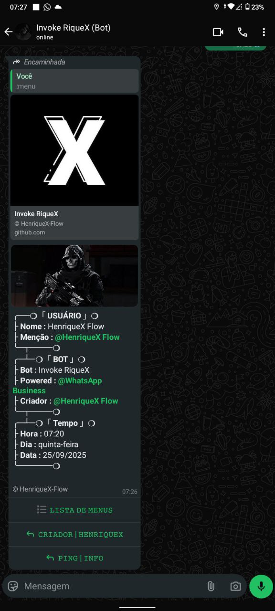
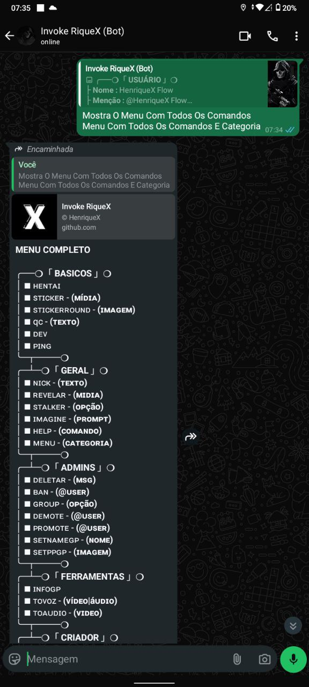
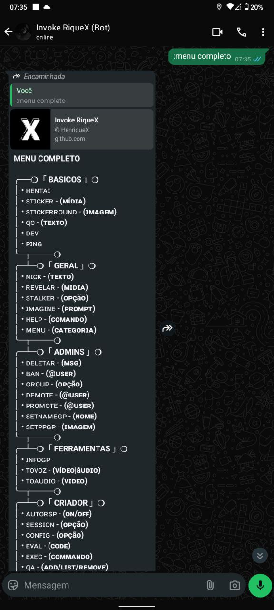

> [!CAUTION]
> Este Projeto Não Possui Qualquer Vínculo Oficial Com O WhatsApp. Ele Foi Desenvolvido De Forma Independente Para Interações Automatizada Por Meio Da Plataforma.
>
> Não Nos Responsabilizamos Por Qualquer Uso Indevido Deste Projeto, É De Responsabilidade Exclusiva Do Usuário Garantir Que Sua Utilização Esteja Em Conformidade Com Os Termos De Uso Do WhatsApp E A Legislação Vigente.

<p align="center">

</p>
<h1 align="center">HenriqueX Flow</h1>

# Tecnologias Utilizadas:

 

---

# Instalando Algumas Dependências Iniciais

```bash
# Ffmpeg Necessário Pra Fazer Figurinha
apt install ffmpeg
# NodeJs Necessário Pra Rodar O Bot
apt install nodejs-lts
```

## Iniciar O Bot Em Modo Desenvolvimento

```bash
# Clone O Repositório
git clone https://github.com/HenriqueX-Flow/Invoke-RiqueX.git
# Acessar A Pasta Do Bot
cd Invoke-RiqueX

# Instale As Dependências
npm install

# Inicie O Bot
npm run dev
```

### Rodando Em No Modo Produção

```bash
# Clone O Repositório
git clone https://github.com/HenriqueX-Flow/Invoke-RiqueX.git
# Acessa A Pasta Do Bot
cd Invoke-RiqueX

# Instale As Dependências
npm install

# Faça A Compilação
npm run build

# Inicie O Bot
npm start
```

---

## 📦 Dependências Principais

- baileys-mod
- typescript
- pino
- qrcode-terminal
- @mengkodingan/consolefy

Veja O [package.json](https://github.com/HenriqueX-Flow/Invoke-RiqueX/blob/main/package.json) Para A Lista Completa.

---

> [!TIP]
> **Para Criar Comandos Navegue Até src/commands E Crie Seus Comandos Veja O Exemplo Abaixo**

```typescript
import { ICommand } from "../common/interface";

const mycmd: ICommand = {
    name: "newcmd", // Nome Do Comando.
    help: "<newcmd>", // Descrição Do Comando.
    category: "basicos", // Categoria Do Comando.
    intro: true, // Intro Automatizada Após Usar O Comando.
    usage: "Apenas Uma Comando Simples" // Explique Como Usar Seu Cmd.
    aliases: ["meucmd", "mycmd"], // Aliases Para Seu Comando.
    async execute(ctx, msg, args) {
        const jid = msg.key.remoteJid!; /* Jid Do Chat A Ser Enviado. */

        const subcmd = args.join(" "); /* Exemplos */

        await ctx.socket.sendMessage(jid, {
            text: "Oi"
            }, { quoted: msg });
    }
}

export default mycmd;
```

## Mensagem Do Menu Enviada Pelo Bot.
- Após Usar :menu O Bot Envia Uma Mensagem Com Uma Imagem, Texto, Atributo De Anúncio E Botões Interativos:


- Quando Um Botão É Clicado O Bot Envia Também Rapidamente O Comando:


- Também É Possível Usar O Comando Menu E Dizer A Categoria Que Deve Ser Enviada No Exemplo :menu basicos Ou :menu completo Como Você Ver Abaixo:


---

## 📝 Licença

MIT

---
